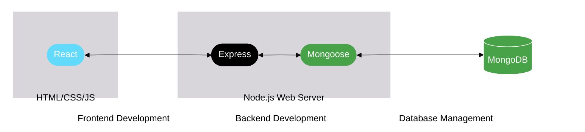

youtube-clone-react
===

> ### **It's MERN Stack 👀** 

```mermaid
 %%{init: { 'theme':'base'} }%%
flowchart TB;

subgraph label[<br><br><br><br><br><br><br><br>ㅤㅤㅤFrontend Developmentㅤ ㅤ ㅤ ㅤ ㅤ ㅤ Backend Developmentㅤㅤㅤ ㅤㅤ ㅤㅤㅤDatabase Managementㅤㅤㅤㅤ]
subgraph front[<br><br><br><br><br>HTML/CSS/JS]
  re([React])
end

subgraph back[<br><br><br><br><br>Node.js Web Server]
    ex([Express]);
    mg([Mongoose]);
    
end

subgraph db[ㅤ]
  mo[(MongoDB)]
end
re <---> ex <--> mg <---> mo
end

classDef MO fill:#47a248,stroke:#fff,color:#fff;
class mo MO;
classDef MG fill:#47a248,stroke-width:0px,color:#fff;
class mg MG;
classDef RE fill:#61dafb,stroke-width:0px,color:#fff;
class re RE;
classDef EX fill:#000000,stroke:#000,color:#fff;
class ex EX;
classDef LA fill:#fff,stroke-width:20px,stroke:#fff,color:#000;
class label,db LA;
classDef END fill:#d8d6db,stroke-width:45px,stroke:#d8d6db,color:#000;
class front,back END;
```
